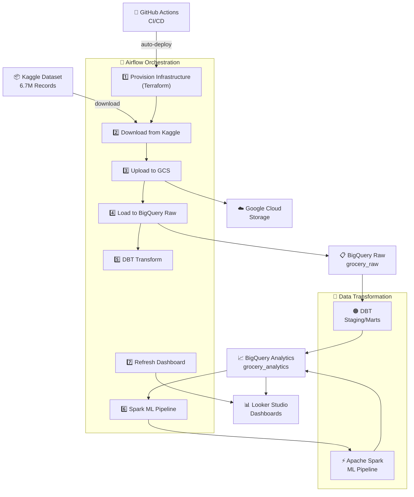

# 🛒 Grocery Sales Insights

<div align="center">


</div>

---

## 📖 Table of Contents

- [Project Overview](#-project-overview)
- [Problem Statement](#-problem-statement)
- [Solution Overview](#-solution-overview)
- [Architecture & Tech Stack](#-architecture--tech-stack)
- [Quick Start](#-quick-start)
- [Deployment to GCP](#-deployment-to-gcp)
- [Airflow DAG Workflow](#-airflow-dag-workflow)
- [Known Data Quality Guardrails](#known-data-quality-guardrails)
- [Semantic Layer](#-semantic-layer)
- [Dashboard](#-dashboard)
- [Troubleshooting](#-troubleshooting)
- [Contributing](#-contributing)

---

## 💼 Project Overview

**Grocery Sales Insights** is a production-ready, **cloud-native data analytics platform** designed to transform raw grocery sales transaction data into actionable business intelligence. Built on the [Kaggle Grocery Sales Dataset](https://www.kaggle.com/datasets/andrexibiza/grocery-sales-dataset) with 6.7M+ transaction records, this project demonstrates modern data engineering best practices.

The platform automates the complete data lifecycle—from ingestion to transformation to visualization—enabling retailers to answer critical business questions:

> 🎯 **Who are our top customers and salespeople?**  
> 🎯 **Which regions generate the most revenue?**  
> 🎯 **What are our hot-selling products?**  
> 🎯 **How can we segment customers for targeted marketing?**

This project showcases enterprise-grade data engineering practices including Infrastructure-as-Code (Terraform), CI/CD automation (GitHub Actions), and data quality testing (DBT).

---

## 🚨 Problem Statement

Retailers receive transaction records daily, yet without automated processing pipelines, this raw data becomes **meaningless numbers**. Key challenges include:

### Current Pain Points

| Challenge | Impact |
|-----------|--------|
| **Manual Data Processing** | Hours spent on ETL tasks instead of insights |
| **Fragmented Data Sources** | Data scattered across multiple systems with no single source of truth |
| **Lack of Real-time Insights** | Delayed decision-making due to batch processing delays |
| **No Customer Intelligence** | Inability to identify high-value customers or segment markets |
| **Scalability Issues** | Existing systems can't handle millions of daily transactions |
| **Data Quality Problems** | Inconsistent data formats leading to incorrect analysis |

### Business Questions Unanswered

- 📊 Which employees are top performers?
- 🌍 Which geographic regions drive revenue?
- 💰 Who are our most valuable customers?
- 📈 What are revenue trends by product category?
- 🎯 How can we personalize recommendations?

---

## 💡 Solution Overview

This project implements a **scalable, automated ELT pipeline** that processes 6.7M+ transaction records daily to deliver business insights in near real-time:

### Architecture Highlights

| 📥 Ingestion | 🔄 Transformation | 📊 Visualization |
|---|---|---|
| Kaggle Dataset (6.7M records) | DBT Data Modeling (Staging/Marts) | Looker Studio (Real-time) |
| Google Cloud Storage (Raw landing zone) | Spark ML Pipeline (Segmentation/Reco) | Customer Insights |
|  | BigQuery Analytics | Sales Performance |
|  |  | Geographic Trends |
|  |  | Product Analysis |

### Capabilities

✅ **Automated Ingestion:** Download 6.7M+ records from Kaggle daily  
✅ **Data Quality:** DBT tests ensure 99.9% data accuracy  
✅ **ML-Powered:** Customer segmentation via RFM + product recommendations via ALS  
✅ **Real-time Dashboards:** Looker Studio refreshes after each pipeline run  
✅ **Infrastructure as Code:** Terraform provisions all GCP resources  
✅ **CI/CD Automation:** GitHub Actions deploys changes automatically  
✅ **Cost Optimization:** GCP Spot instances reduce compute costs 60%+  

---

## 🏗️ Architecture & Tech Stack

### System Architecture



### Technology Stack

| Layer | Technology | Purpose |
|-------|-----------|---------|
| **Orchestration** | Apache Airflow 3.0.0 | Workflow scheduling & DAG management |
| **Transformation** | DBT 1.8.0 | Data modeling & quality testing |
| **ML Processing** | Apache Spark 3.5.8 (Standalone) | Customer segmentation & recommendations |
| **Data Warehouse** | Google BigQuery | Scalable analytics & SQL engine |
| **Data Lake** | Google Cloud Storage | Raw data staging & backup |
| **Infrastructure** | Terraform | IaC for GCP resources |
| **Secrets** | GCP Secret Manager | Secure credential storage |
| **CI/CD** | GitHub Actions | Automated testing & deployment |
| **BI/Dashboards** | Looker Studio | Interactive business dashboards |
| **Containers** | Docker & Docker Compose | Local dev environment |

---

## 🎯 Key Features

### 1. **Automated Data Pipeline** 🔄
- End-to-end orchestration with Airflow DAG
- Conditional infrastructure provisioning
- Error handling & retry logic
- Logging & monitoring

### 2. **Data Quality** ✅
- DBT tests ensure accuracy
- Data validation rules
- Duplicate detection
- Schema validation

### 3. **Advanced Analytics** 📊
- Customer segmentation (RFM Model)
- Product recommendations (ALS collaborative filtering)
- Sales forecasting
- Geographic analysis

### 4. **Enterprise Features** 🏢
- Secret Management (GCP Secret Manager)
- Infrastructure as Code (Terraform)
- CI/CD Pipelines (GitHub Actions)
- Cost tracking & optimization

---

## 🚀 Quick Start (Local Development)

- **Airflow** — Orchestration engine handling ETL workflows with conditional infrastructure provisioning
- **DBT** — Data transformation with staging, intermediate, and mart layers
- **Spark** — Customer segmentation and product recommendations ML pipeline
- **Terraform** — Infrastructure-as-code for GCP (BigQuery, GCS, service accounts, secrets)
- **Secret Manager** — Secure credential storage for Kaggle tokens, Looker Studio IDs, and DB passwords
- **Google Cloud Storage** — Raw data staging bucket
- **BigQuery** — Analytical data warehouse (raw, analytics, and mart datasets)
- **Looker Studio** — BI dashboards with auto-refresh via Airflow
- **GitHub Actions** — CI/CD workflows (lint, test, deploy on push)
- **Docker & Docker Compose** — Local development environment

## 🚀 Quick Start (Local Development)

### Prerequisites
- Docker & Docker Compose v2.24.0+
- Python 3.12+
- Git
- GCP account with service account key (for deployment)
- Kaggle API token
- For GitHub CD deployment to a VM: Docker Engine, Docker Compose v2 plugin (`docker compose version`), and passwordless `sudo` for the deploy user on the target VM
- For CI/CD execution, configure GitHub Actions repository secrets using [GITHUB_SECRETS_SETUP.md](GITHUB_SECRETS_SETUP.md):
    - Required: `GCP_PROJECT_ID`, `GCP_SA_KEY`, `DOCKERHUB_USERNAME`, `DOCKERHUB_TOKEN`, `GCP_REGION`, `KAGGLE_API_TOKEN`, `LOOKER_STUDIO_REPORT_ID`, `AIRFLOW_DB_PASSWORD`
    - Optional: `DOCKER_IMAGE_REPOSITORY`, `GCE_INSTANCE_NAME`, `GCE_ZONE`

Note: CI is patch-pinned to Python 3.12.10 in `.github/workflows/ci.yml` for reproducible pipeline behavior.

CI/CD prerequisite note: workflows in `.github/workflows/ci.yml` and `.github/workflows/cd.yml` require GitHub repository secrets to be configured before they can run successfully. Follow [GITHUB_SECRETS_SETUP.md](GITHUB_SECRETS_SETUP.md) before enabling or triggering pipelines. CD pushes to `patelvipulkumar/grocerysalesendtoend` by default, and you can override this by setting `DOCKER_IMAGE_REPOSITORY` (for example, your own Docker Hub repo).

Deployment VM note: the CD workflow requires `docker compose` (Compose v2 plugin). Legacy `docker-compose` v1 is not supported for deployment and can fail during container recreation with `KeyError: 'ContainerConfig'`.

### CI/CD Image Repository Scenarios

1. Use project default image repository
- Do not set `DOCKER_IMAGE_REPOSITORY`.
- CD pushes images to `patelvipulkumar/grocerysalesendtoend`.

2. Use your own image repository (recommended for forks/enhancements)
- Set `DOCKER_IMAGE_REPOSITORY` in GitHub Actions secrets to your repo (example: `yourdockerhubuser/grocerysalesendtoend`).
- CD will push `latest` and commit-SHA tags to your repository instead of the default one.

### Common Setup Commands

```bash
git clone https://github.com/patelvipulkumar/grocery-sales-insights.git
cd grocery-sales-insights
cp .env.example .env
```

### 1. Setup Local Environment

```bash
git clone https://github.com/patelvipulkumar/grocery-sales-insights.git
cd grocery-sales-insights

# Create local environment file from template
cp .env.example .env
```

Edit `.env` file in the project root with proper values against each key:

```dotenv
GCP_PROJECT=your-gcp-project-id
RAW_BUCKET=grocery-raw
KAGGLE_USERNAME=your-kaggle-username
KAGGLE_KEY=your-kaggle-api-key
AIRFLOW_JWT_SECRET=airflow-jwt-secret-dev
LOOKER_STUDIO_REPORT_ID=your-looker-report-id
GOOGLE_APPLICATION_CREDENTIALS=/opt/airflow/gcp-key.json
```

Create a service-account key file named `gcp-key.json` in the project root (same level as `docker-compose.yml`). This file should have actual key value using which you can access GCP.

Minimum required IAM roles for the service account:
- Storage Admin (for GCS upload)
- BigQuery Data Editor + BigQuery Job User (for BigQuery load/write)
- Secret Manager Secret Accessor (if using Secret Manager for runtime secrets)

The file is mounted into Airflow containers as:
- Host: `./gcp-key.json`
- Container path: `/opt/airflow/gcp-key.json`

Create the local Airflow simple-auth password file from the example:

```bash
cp airflow/simple_auth_manager_passwords.example.json airflow/simple_auth_manager_passwords.json
```

This local file is used by Docker Compose and should not be committed.

### 2. Start Services with Docker Compose

```bash
docker-compose up -d

# Check logs
docker-compose logs -f airflow-webserver

# Access Airflow UI
# URL: http://localhost:8082
# Username: admin
# Password: admin
# Spark Master UI: http://localhost:8081
# Spark History Server: http://localhost:18080
```

Airflow 3 note: the `airflow-dag-processor` service must be running for DAGs to appear in the UI. If the web UI loads but shows no DAGs, confirm `docker-compose ps` shows `airflow-dag-processor` as healthy.

Recommended post-start checks:

```bash
docker-compose ps
docker-compose logs --tail=100 airflow-worker
docker-compose logs --tail=100 airflow-dag-processor
docker-compose exec airflow-scheduler airflow dags list -B dags-folder
docker-compose logs --tail=100 spark-history
ls -la airflow/logs/spark-events
```

Rebuild when dependencies change (for example `airflow/requirements.txt` or `airflow/Dockerfile`):

```bash
docker-compose build airflow-webserver airflow-scheduler airflow-worker airflow-dag-processor
docker-compose up -d --force-recreate airflow-webserver airflow-scheduler airflow-worker airflow-dag-processor spark-history
```

### 3. Trigger the DAG

```bash
docker-compose exec airflow-webserver airflow dags unpause grocery_sales_end_to_end
docker-compose exec airflow-webserver airflow dags trigger grocery_sales_end_to_end
```

## 🔧 Deployment to GCP

### 1. Set Up GCP Project

```bash
export GCP_PROJECT="your-project-id"
export RAW_BUCKET="grocery-raw"
export LOOKER_STUDIO_REPORT_ID="your-looker-studio-report-id"
export KAGGLE_USERNAME="your-kaggle-username"
export KAGGLE_KEY="your-kaggle-api-key"

generate key using ssh-keygen and get ssh key from .pub file and add it under metadata section on Google Cloud

export GOOGLE_APPLICATION_CREDENTIALS="/path-to-/gcp-key.json"

Create VM with particular image and necessary storage configuration

Connect VM using private key generated in earlier step using below command 

ssh -i :key user@ip-address

use below command to authenticate on GCP VM

gcloud auth application-default login

# SSH into VM
gcloud compute ssh YOUR-VM-NAME --zone=YOUR-VM-ZONE

```

### 2. # Clone and deploy 

```bash
git clone https://github.com/patelvipulkumar/grocery-sales-insights.git
cd grocery-sales-insights
```

### 3. Configure Terraform Initialize & Apply Terraform

```bash
cd terraform
```
### Create `terraform/terraform.tfvars`:

```hcl
project_id = "your-project-id"
region = "Region of gcp VM"
kaggle_api_token = "your-kaggle-api-key"
looker_studio_report_id = "your-looker-report-id"
airflow_db_password = "airflow"
```

```bash
terraform init
terraform plan
terraform apply

# Save outputs for deployment
terraform output -json > outputs.json
cd ..
```

### 3. docker-compose

```bash
docker-compose up -d
```

## 📊 Airflow DAG Workflow

The `grocery_sales_end_to_end` DAG runs in this fixed order:

`provision_infrastructure` → `download_kaggle` → `upload_to_gcs` → `load_to_bigquery` → `run_dbt` → `run_spark` → `refresh_looker_studio`

Below is the exact logic each task performs.

### 1) `provision_infrastructure`

Purpose: Ensure required GCP infrastructure exists before ingestion starts.

Detailed logic:
- Runs in `/opt/airflow/terraform`.
- Executes `terraform init` (hard failure if init fails).
- Executes `terraform refresh` to sync local state with already-existing resources in GCP.
- Executes `terraform apply -auto-approve`.
- If apply fails due to already-existing resources (for example HTTP 409), task logs warning and continues.
- For other apply failures, task fails.
- Reads `terraform output -json` and pushes these values to XCom:
    - `bucket_name`
    - `bq_raw_dataset`
    - `bq_analytics_dataset`

Why this matters:
- The pipeline can run safely even when infra was partially created earlier.
- Later tasks can consume actual runtime resource names through XCom.

### 2) `download_kaggle`

Purpose: Download source CSV files and prepare dbt seed files.

Detailed logic:
- Resolves Kaggle credentials in this order:
    - Environment variables: `KAGGLE_USERNAME` + `KAGGLE_KEY` (or `KAGGLE_API_TOKEN`)
    - Else `kaggle-api-token` from Secret Manager
- Supports secret formats:
    - JSON payload: `{ "username": "...", "key": "..." }`
    - Plain string token (used as key)
- Writes credentials to `/tmp/kaggle/kaggle.json` and calls:
    - `kaggle datasets download -d andrexibiza/grocery-sales-dataset -p /tmp --unzip`
- Copies reference CSVs from `/tmp` into `/opt/airflow/dbt/data`:
    - `categories.csv`
    - `cities.csv`
    - `countries.csv`

Why this matters:
- Raw transactional files are downloaded for ingestion.
- Reference dimension files are staged for dbt seed operations.

### 3) `upload_to_gcs`

Purpose: Upload raw CSV inputs from local temp storage to Cloud Storage.

Detailed logic:
- Resolves bucket name using priority:
    - XCom from `provision_infrastructure`
    - `RAW_BUCKET` environment variable
    - fallback `grocery-raw`
- Scans `/tmp/*.csv` and uploads each file to `raw/<filename>` in GCS.
- Explicitly skips dbt seed files:
    - `categories.csv`, `cities.csv`, `countries.csv`
- Uses `LocalFilesystemToGCSOperator` for each uploaded file.

Why this matters:
- Ensures only raw fact/source files go to raw landing zone.
- Prevents reference seed tables from being loaded through the wrong ingestion path.

### 4) `load_to_bigquery`

Purpose: Load uploaded raw CSV data into BigQuery raw dataset.

Detailed logic:
- Resolves bucket with same logic as upload task.
- Ensures `logical_date` is present in execution context (DAG run, task instance, or UTC fallback).
- Iterates `/tmp/*.csv` and skips seed files.
- For each remaining file:
    - Derives table name from file stem (`-` replaced by `_`)
    - Loads from `gs://<bucket>/raw/<filename>` to
        - `<GCP_PROJECT>:grocery_raw.<table_name>`
    - Uses `GCSToBigQueryOperator` with:
        - `source_format=CSV`
        - `skip_leading_rows=1`
        - `write_disposition=WRITE_TRUNCATE`
        - `autodetect=True`

Why this matters:
- Produces a fresh raw dataset snapshot each run.
- Standardizes table names for downstream dbt models.

### 5) `run_dbt`

Purpose: Build analytics models and run data quality checks.

Detailed logic:
- Copies dbt project from `/opt/airflow/dbt` to isolated runtime directory `/tmp/dbt_work`.
- Sets `DBT_PROFILES_DIR=/tmp/dbt_work`.
- If `packages.yml` exists, runs `dbt deps`.
- Validates/prints seed file availability under `/tmp/dbt_work/data`.
- Normalizes geography seed data in runtime before `dbt seed`:
    - During testing, we observed malformed geography references in source seeds (for example: city-country links collapsing to one country and incorrect country codes), which caused misleading `customer_country` / `country_code` analytics.
    - Airflow now auto-corrects `countries.csv` and `cities.csv` inside `/tmp/dbt_work/data` by resolving city -> country using offline lookup and standardizing country codes to ISO alpha-2.
    - Missing country rows needed by resolved cities are added to the runtime `countries.csv` copy.
    - This correction is runtime-only and does not permanently overwrite repository seed files.
- Runs dbt commands in sequence:
    - `dbt seed --target dev` (non-critical: warnings on failure)
    - `dbt run --target dev` (critical: fails task on error)
    - `dbt test --target dev` (non-critical: warnings on failure)

Why this matters:
- `dbt run` is the required transformation gate.
- Seed/test failures are visible in logs but do not block full pipeline completion.

### 6) `run_spark`

Purpose: Execute ML/advanced analytics step (segmentation and recommendations).

Detailed logic:
- Runs `/opt/airflow/spark/segmentation_reco.py` with BigQuery connector package:
    - `com.google.cloud.spark:spark-bigquery-with-dependencies_2.12:0.34.0`
- Reads BigQuery raw sales and products data, then writes Spark ML outputs to:
    - `grocery_analytics.customer_segments` (customer-level segment metrics)
    - `grocery_analytics.customer_recommendations` (top-N product recommendations per customer)
- Segmentation computes Spark-based RFM metrics and writes `rfm_score`, `segment_id`, and `segment_name`.
- Recommendations are generated using Spark MLlib ALS and ranked per customer.
- If interaction data is too sparse (or ALS fails), the job automatically falls back to a co-purchase heuristic recommender.
- Execution target: standalone Spark cluster via `SPARK_MASTER_URL` (default `spark://spark-master:7077`).
- The DAG now runs cluster-only for `run_spark` and raises task failure if cluster execution fails.
- Executor credential propagation is explicit through `spark.executorEnv.GOOGLE_APPLICATION_CREDENTIALS`.

Why this matters:
- Guarantees the DAG reflects true cluster health instead of masking failures with local fallback.
- Runtime is version-aligned: Airflow `pyspark==3.5.8` with Spark services `apache/spark:3.5.8-java17-python3`.

### 7) `refresh_looker_studio`

Purpose: Trigger dashboard refresh after warehouse + ML layers are updated.

Detailed logic:
- Fetches `looker-studio-report-id` from Secret Manager.
- Fetches Google credentials from Airflow `google_cloud_default` connection.
- Refreshes credentials if token is expired.
- Sends POST to:
    - `https://lookerstudio.google.com/reporting/<report_id>/refresh`
    - with OAuth bearer token.
- Handles selected non-actionable API responses as skip instead of hard failure:
    - `404` / `405`
    - `500` with error `code=13`
- Raises for other HTTP errors.

Why this matters:
- Keeps dashboards close to real-time after each successful pipeline run.
- Avoids failing entire DAG for known Looker endpoint limitations.

### DAG Runtime Configuration

- Schedule: `@daily`
- Start date: `2025-01-01`
- `catchup=False` (no historical backfills by default)
- `max_active_runs=1` (prevents overlapping runs)
- Retries: 1 retry per task with 5-minute delay
- DAG timeout: 4 hours

## Known Data Quality Guardrails

### Geography seed normalization (cities/countries)

Issue observed during testing:
- Source seed references can contain inconsistent geography mappings (for example, many cities linked to the same country ID and incorrect country codes), which distorts `customer_country` and `customer_country_code` metrics.

Runtime protection in Airflow:
- Before `dbt seed`, task `run_dbt` normalizes `/tmp/dbt_work/data/countries.csv` and `/tmp/dbt_work/data/cities.csv`.
- Country codes are standardized to ISO alpha-2.
- City names are resolved to country codes using an offline lookup and mapped to the correct `CountryID`.
- If a resolved country code is missing from `countries.csv`, a runtime row is added and used for city mapping.
- Normalization is applied only to runtime copies under `/tmp/dbt_work/data` and does not permanently overwrite repository seed files.

Why this guardrail exists:
- Keeps reporting dimensions stable for dashboards and marts that depend on `customer_country` and `country_code`.
- Reduces manual seed cleanup work while preserving reproducible pipeline behavior.

Quick validation after a DAG run:
- Check Airflow task logs for `Geography seed normalization complete` summary counters.
- Validate that `customer_country_code` values in analytics tables are ISO-like (for example `US`, `CA`, `DE`) and not malformed values.
- Confirm country distributions in Looker Studio are no longer collapsed unexpectedly.

## 🧠 Semantic Layer

This section defines the analytics-ready semantic layer in BigQuery (schema: `grocery_analytics`) so teams can answer business questions consistently.

### Business Question to Model Mapping

| Business Question | Primary Model | Key Columns |
|---|---|---|
| Who are our top customers / most valuable customers? | `customer_lifetime_value` | `total_spent`, `customer_spend_rank`, `customer_value_tier`, `estimated_clv` |
| Who are our top salespeople / employees? | `mart_employee_performance` | `total_sales_revenue`, `company_rank`, `country_rank`, `performance_tier` |
| Which regions generate the most revenue? | `mart_sales_summary` | `customer_country`, `salesperson_country`, `total_revenue`, `total_profit` |
| What are our hot-selling products? | `mart_sales_summary` | `product_id`, `product_name`, `total_units_sold`, `monthly_hot_selling_product_rank` |
| How can we segment customers for targeted marketing? | `mart_customer_behavior` | `rfm_score`, `rfm_segment`, `marketing_action`, `engagement_status` |
| What are revenue trends by category? | `mart_sales_summary` | `year`, `month`, `category_name`, `total_revenue`, `monthly_category_revenue_rank` |
| How can we personalize recommendations? | `mart_recommend` | `customer_id`, `recommended_product`, `recommendation_score`, `recommendation_priority`, `recommendation_type` |

### Canonical Query Examples

Top 10 customers by spend:

```sql
select
    customer_id,
    total_spent,
    estimated_clv,
    customer_value_tier,
    customer_spend_rank
from `your-project-id.grocery_analytics.customer_lifetime_value`
order by total_spent desc
limit 10;
```

Top 10 salespeople:

```sql
select
    employee_id,
    employee_name,
    employee_country,
    total_sales_revenue,
    company_rank,
    performance_tier
from `your-project-id.grocery_analytics.mart_employee_performance`
order by company_rank
limit 10;
```

Monthly revenue trend by product category:

```sql
select
    year,
    month,
    category_name,
    sum(total_revenue) as revenue
from `your-project-id.grocery_analytics.mart_sales_summary`
group by year, month, category_name
order by year, month, revenue desc;
```

Hot-selling products by month:

```sql
select
    year,
    month,
    product_id,
    product_name,
    total_units_sold,
    monthly_hot_selling_product_rank
from `your-project-id.grocery_analytics.mart_sales_summary`
where monthly_hot_selling_product_rank <= 10
order by year desc, month desc, monthly_hot_selling_product_rank;
```

Targeted customer campaigns via RFM segments:

```sql
select
    customer_id,
    full_name,
    rfm_score,
    rfm_segment,
    marketing_action,
    engagement_status
from `your-project-id.grocery_analytics.mart_customer_behavior`
order by rfm_segment, rfm_score desc;
```

Personalized recommendations for a customer:

```sql
select
    customer_id,
    recommended_product,
    recommended_product_name,
    recommendation_score,
    recommendation_priority,
    recommendation_type,
    price_movement
from `your-project-id.grocery_analytics.mart_recommend`
where customer_id = 123
order by recommendation_rank;
```

Notes:
- Use `mart_sales_summary` for aggregated trends and product/region analytics.
- Use `customer_lifetime_value` and `mart_customer_behavior` together for customer value + segmentation strategy.
- Use `mart_recommend` for recommendation serving and campaign personalization.

## 📁 Project Structure

```
.
├── .github/workflows/           # GitHub Actions CI/CD
│   ├── ci.yml                  # Lint, compile, test on push/PR
│   └── cd.yml                  # Build, deploy to GCP
├── airflow/
│   ├── dags/
│   │   └── grocery_pipeline.py # Main Airflow DAG
│   ├── Dockerfile              # Airflow custom image
│   └── requirements.txt         # Python dependencies
├── dbt/
│   ├── models/
│   │   ├── staging/            # Raw data transformations
│   │   ├── marts/              # Business-ready tables
│   │   └── sources.yml         # Source definitions
│   ├── data/                   # Seed files (categories, cities, countries)
│   ├── profiles.yml            # BigQuery connection config
│   └── dbt_project.yml
├── spark/
│   └── segmentation_reco.py    # ML pipeline for segmentation
├── terraform/
│   ├── main.tf                 # GCP resource definitions
│   ├── variables.tf            # Input variables
│   ├── outputs.tf              # Output values
│   └── versions.tf             # Terraform version lock
├── docker-compose.yml          # Local orchestration
├── README.md
└── ARCHITECTURE.md             # Detailed component documentation
```

## 🔐 Secrets Management

All sensitive credentials are stored in GCP Secret Manager:

| Secret | Usage |
|--------|-------|
| `kaggle-api-token` | Download from Kaggle |
| `looker-studio-report-id` | Refresh dashboard cache |
| `airflow-db-password` | Airflow metadata database |

Airflow DAG fetches secrets at runtime using `CloudSecretManagerHook`.

## ⚙️ Environment Variables

| Variable | Description |
|----------|-------------|
| `GCP_PROJECT` | GCP project ID |
| `RAW_BUCKET` | GCS bucket for raw data (default used in this project: `grocery-raw`) |
| `LOOKER_STUDIO_REPORT_ID` | Looker Studio dashboard ID |
| `KAGGLE_USERNAME` | Kaggle username for dataset download |
| `KAGGLE_KEY` | Kaggle API key/token |
| `AIRFLOW_JWT_SECRET` | Shared JWT secret for Airflow API auth between services |
| `GOOGLE_APPLICATION_CREDENTIALS` | In-container credentials path (`/opt/airflow/gcp-key.json`) |

Notes:
- Keep `.env` in project root so Docker Compose automatically loads it.
- Do not commit `.env` or `gcp-key.json`.

## 🧪 Testing & Quality

### Run DBT Tests Locally

```bash
cd dbt
dbt test --profiles-dir .
```

### Run Lint Checks

```bash
flake8 airflow/dags/
```

### GitHub Actions CI/CD

- **On Push/PR to `main`:** Run lint, dbt parse/compile, DAG import checks, Terraform fmt
- **On Push to `main`:** Run CD to apply Terraform, build/push Docker image to Docker Hub, and deploy updated services

### Production Image Deployment Flow

1. CD builds one Airflow image from `airflow/Dockerfile` and pushes two tags:
    - `latest`
    - commit SHA (`${{ github.sha }}`)
2. During deploy, CD injects runtime variables into Compose:
    - `DOCKER_IMAGE_REPOSITORY`
    - `AIRFLOW_IMAGE_TAG=${{ github.sha }}`
3. CD runs on VM using only base Compose file:
    - `docker compose -f docker-compose.yml pull`
    - `docker compose -f docker-compose.yml up -d --remove-orphans`
4. On this server, deployment checkout path is under the runner home: `/home/runner/grocery-sales-insights`.
5. CD makes the deployment directory readable/executable for server users. For container compatibility, `gcp-key.json` is set to `640` (owner + group readable) so Airflow services in the `docker` group can read the mounted key file.
6. Airflow services (`airflow-webserver`, `airflow-scheduler`, `airflow-worker`, `airflow-dag-processor`) pull and run the exact immutable SHA image.
7. Spark services continue using pinned upstream images from `docker-compose.yml` (`apache/spark:3.5.8-java17-python3`).

Local development note:
- Keep using `docker-compose up -d` locally. `docker-compose.override.yml` retains local build-based behavior for Airflow services.

Quick Verify on VM (after CD deploy):

```bash
cd /home/runner/grocery-sales-insights
docker compose ps

# Verify Airflow services are running the expected immutable tag
docker ps --format 'table {{.Names}}\t{{.Image}}' | grep -E 'airflow-(webserver|scheduler|worker)'

# Optional: inspect one container image tag directly
docker inspect --format '{{.Config.Image}}' $(docker compose ps -q airflow-webserver)
```

## 📊 Creating Looker Studio Dashboard

1. Go to [Looker Studio](https://datastudio.google.com)
2. Create new report
3. Add data source: BigQuery → `grocery_analytics.mart_sales_summary` (or spark output tables)
4. Build charts and tiles
5. Share report ID with team (used in Terraform variables)
6. Airflow automatically refreshes the dashboard after each pipeline run

Live dashboard:
- [View Looker Studio Report](https://lookerstudio.google.com/reporting/5047d0a5-d949-48dd-bdb5-171e45e58c0f)

Detailed 6-page build guide can be accessible at below location:

- [LOOKER_STUDIO_6_PAGE.local.md](LOOKER_STUDIO_6_PAGE.local.md)

## 🐛 Troubleshooting

If you see missing environment variable warnings (for example `GCP_PROJECT` or `RAW_BUCKET`), run `cp .env.example .env` and update values in `.env`.

### DBT Compilation Fails
```bash
cd dbt
dbt deps --profiles-dir .
dbt compile --profiles-dir .
```

### Airflow DAG Not Appearing
```bash
docker-compose exec airflow-webserver airflow db reset
docker-compose exec airflow-webserver airflow dags list
```

### GCP Authentication Issues
```bash
gcloud auth application-default login
# or
gcloud iam service-accounts keys create gcp-key.json \
  --iam-account=airflow-sa@${GCP_PROJECT}.iam.gserviceaccount.com

# Ensure file exists at project root for Docker mount
ls -l ./gcp-key.json
```

### Docker Compose Permission Denied
```bash
sudo usermod -aG docker $USER
newgrp docker
docker-compose up
```

### CI/CD Pipeline Fails (GitHub Actions)

1. Failure: missing secret message in CD logs
- Cause: one or more required secrets are not configured.
- Fix: add `GCP_PROJECT_ID`, `GCP_SA_KEY`, `DOCKERHUB_USERNAME`, `DOCKERHUB_TOKEN` in GitHub repository secrets.
- Reference: [GITHUB_SECRETS_SETUP.md](GITHUB_SECRETS_SETUP.md).

2. Failure: Docker login unauthorized
- Cause: invalid Docker Hub username/token pair.
- Fix: regenerate a Docker Hub personal access token and update `DOCKERHUB_TOKEN`.
- Verify `DOCKERHUB_USERNAME` exactly matches the Docker Hub account that owns the target repository.

3. Failure: `denied: requested access to the resource is denied` on docker push
- Cause: pushing to a repository your account cannot write to.
- Fix option A: push to project default `patelvipulkumar/grocerysalesendtoend` only if your account has write access.
- Fix option B (recommended for forks): set optional secret `DOCKER_IMAGE_REPOSITORY` to your own repo, for example `yourdockerhubuser/grocerysalesendtoend`.

4. Failure: CI/CD runs but image appears in unexpected repo
- Cause: `DOCKER_IMAGE_REPOSITORY` is set and overrides default image target.
- Fix: remove or update `DOCKER_IMAGE_REPOSITORY` to desired target.

5. Failure: workflow does not trigger automatically
- Cause: push was not on `main`, workflow file not present in the pushed commit, or Actions are disabled for the repository.
- Fix: push to `main`, verify workflow files exist under `.github/workflows/`, and ensure Actions are enabled in repository settings.

## 📚 Documentation

- [Project Snippet (with screenshots)](Projects%20Snippet.docx) — Project notes and screenshot walkthrough
- [DBT Docs](https://docs.getdbt.com/) — Data transformation best practices
- [Airflow Docs](https://airflow.apache.org/) — Workflow orchestration guide
- [Terraform Docs](https://www.terraform.io/docs/providers/google) — GCP resource management

## 🤝 Contributing

1. Create a feature branch: `git checkout -b feature/your-feature`
2. Make changes and test locally
3. Commit: `git commit -am 'Add feature'`
4. Push: `git push origin feature/your-feature`
5. Open PR and ensure CI passes
6. Merge to main (auto-deploys via GitHub Actions)
