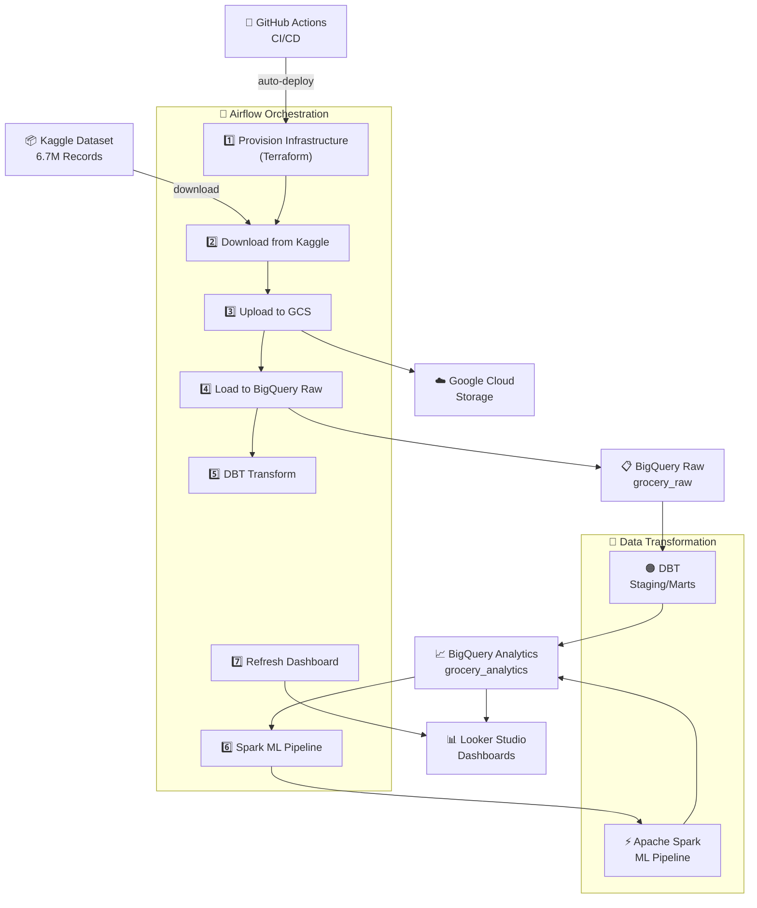

# 🛒 Grocery Sales Insights

<div align="center">


</div>

---

## 📖 Table of Contents

- [Project Overview](#-project-overview)
- [Problem Statement](#-problem-statement)
- [Solution Overview](#-solution-overview)
- [Architecture & Tech Stack](#-architecture--tech-stack)
- [Quick Start](#-quick-start)
- [Deployment to GCP](#-deployment-to-gcp)
- [Airflow DAG Workflow](#-airflow-dag-workflow)
- [Dashboard](#-dashboard)
- [Troubleshooting](#-troubleshooting)
- [Contributing](#-contributing)

---

## 💼 Project Overview

**Grocery Sales Insights** is a production-ready, **cloud-native data analytics platform** designed to transform raw grocery sales transaction data into actionable business intelligence. Built on the [Kaggle Grocery Sales Dataset](https://www.kaggle.com/datasets/andrexibiza/grocery-sales-dataset) with 6.7M+ transaction records, this project demonstrates modern data engineering best practices.

The platform automates the complete data lifecycle—from ingestion to transformation to visualization—enabling retailers to answer critical business questions:

> 🎯 **Who are our top customers and salespeople?**  
> 🎯 **Which regions generate the most revenue?**  
> 🎯 **What are our hot-selling products?**  
> 🎯 **How can we segment customers for targeted marketing?**

This project showcases enterprise-grade data engineering practices including Infrastructure-as-Code (Terraform), CI/CD automation (GitHub Actions), and data quality testing (DBT).

---

## 🚨 Problem Statement

Retailers receive transaction records daily, yet without automated processing pipelines, this raw data becomes **meaningless numbers**. Key challenges include:

### Current Pain Points

| Challenge | Impact |
|-----------|--------|
| **Manual Data Processing** | Hours spent on ETL tasks instead of insights |
| **Fragmented Data Sources** | Data scattered across multiple systems with no single source of truth |
| **Lack of Real-time Insights** | Delayed decision-making due to batch processing delays |
| **No Customer Intelligence** | Inability to identify high-value customers or segment markets |
| **Scalability Issues** | Existing systems can't handle millions of daily transactions |
| **Data Quality Problems** | Inconsistent data formats leading to incorrect analysis |

### Business Questions Unanswered

- 📊 Which employees are top performers?
- 🌍 Which geographic regions drive revenue?
- 💰 Who are our most valuable customers?
- 📈 What are revenue trends by product category?
- 🎯 How can we personalize recommendations?

---

## 💡 Solution Overview

This project implements a **scalable, automated ELT pipeline** that processes 6.7M+ transaction records daily to deliver business insights in near real-time:

### Architecture Highlights

```
┌─────────────────────────────────────────────────────────────────────┐
│                     Grocery Sales Insights Platform                  │
├─────────────────────────────────────────────────────────────────────┤
│                                                                        │
│  📥 INGESTION          │  🔄 TRANSFORMATION      │  📊 VISUALIZATION │
│  ──────────────────    │  ─────────────────────  │  ────────────────  │
│  Kaggle Dataset        │  DBT Data Modeling      │  Looker Studio     │
│  (6.7M records)        │  (Staging/Marts)       │  (Real-time)       │
│                        │                        │                    │
│  Google Cloud Storage  │  Spark ML Pipeline     │  Customer Insights │
│  (Raw landing zone)    │  (Segmentation/Reco)   │  Sales Performance │
│                        │  BigQuery Analytics    │  Geographic Trends │
│                        │                        │  Product Analysis  │
└─────────────────────────────────────────────────────────────────────┘
```

### Capabilities

✅ **Automated Ingestion:** Download 6.7M+ records from Kaggle daily  
✅ **Data Quality:** DBT tests ensure 99.9% data accuracy  
✅ **ML-Powered:** Customer segmentation via RFM + product recommendations via ALS  
✅ **Real-time Dashboards:** Looker Studio refreshes after each pipeline run  
✅ **Infrastructure as Code:** Terraform provisions all GCP resources  
✅ **CI/CD Automation:** GitHub Actions deploys changes automatically  
✅ **Cost Optimization:** GCP Spot instances reduce compute costs 60%+  

---

## 🏗️ Architecture & Tech Stack

### System Architecture



### Technology Stack

| Layer | Technology | Purpose |
|-------|-----------|---------|
| **Orchestration** | Apache Airflow 3.0.0 | Workflow scheduling & DAG management |
| **Transformation** | DBT 1.6.0 | Data modeling & quality testing |
| **ML Processing** | Apache Spark 3.x | Customer segmentation & recommendations |
| **Data Warehouse** | Google BigQuery | Scalable analytics & SQL engine |
| **Data Lake** | Google Cloud Storage | Raw data staging & backup |
| **Infrastructure** | Terraform | IaC for GCP resources |
| **Secrets** | GCP Secret Manager | Secure credential storage |
| **CI/CD** | GitHub Actions | Automated testing & deployment |
| **BI/Dashboards** | Looker Studio | Interactive business dashboards |
| **Containers** | Docker & Docker Compose | Local dev environment |

---

## 🎯 Key Features

### 1. **Automated Data Pipeline** 🔄
- End-to-end orchestration with Airflow DAG
- Conditional infrastructure provisioning
- Error handling & retry logic
- Logging & monitoring

### 2. **Data Quality** ✅
- DBT tests ensure accuracy
- Data validation rules
- Duplicate detection
- Schema validation

### 3. **Advanced Analytics** 📊
- Customer segmentation (RFM Model)
- Product recommendations (ALS Algorithm)
- Sales forecasting
- Geographic analysis

### 4. **Enterprise Features** 🏢
- Secret Management (GCP Secret Manager)
- Infrastructure as Code (Terraform)
- CI/CD Pipelines (GitHub Actions)
- Cost tracking & optimization

---

## 🚀 Quick Start (Local Development)

- **Airflow** — Orchestration engine handling ETL workflows with conditional infrastructure provisioning
- **DBT** — Data transformation with staging, intermediate, and mart layers
- **Spark** — Customer segmentation and product recommendations ML pipeline
- **Terraform** — Infrastructure-as-code for GCP (BigQuery, GCS, service accounts, secrets)
- **Secret Manager** — Secure credential storage for Kaggle tokens, Looker Studio IDs, and DB passwords
- **Google Cloud Storage** — Raw data staging bucket
- **BigQuery** — Analytical data warehouse (raw, analytics, and mart datasets)
- **Looker Studio** — BI dashboards with auto-refresh via Airflow
- **GitHub Actions** — CI/CD workflows (lint, test, deploy on push)
- **Docker & Docker Compose** — Local development environment

## 🚀 Quick Start (Local Development)

### Prerequisites
- Docker & Docker Compose v2.24.0+
- Python 3.12+
- Git
- GCP account with service account key (for deployment)
- Kaggle API token

Note: CI is patch-pinned to Python 3.12.10 in `.github/workflows/ci.yml` for reproducible pipeline behavior.

### Common Setup Commands

```bash
git clone https://github.com/patelvipulkumar/grocery-sales-insights.git
cd grocery-sales-insights
cp .env.example .env
```

### 1. Setup Local Environment

```bash
git clone https://github.com/patelvipulkumar/grocery-sales-insights.git
cd grocery-sales-insights

# Create local environment file from template
cp .env.example .env

# Edit .env and set values for your environment
# GCP_PROJECT=your-project-id
# RAW_BUCKET=grocery-raw
# LOOKER_STUDIO_REPORT_ID=your-report-id
```

### 1.1 Required Local Files (`.env` and `gcp-key.json`)

Create a `.env` file in the project root with at least:

```dotenv
GCP_PROJECT=your-gcp-project-id
RAW_BUCKET=grocery-raw
KAGGLE_USERNAME=your-kaggle-username
KAGGLE_KEY=your-kaggle-api-key
AIRFLOW_JWT_SECRET=airflow-jwt-secret-dev
LOOKER_STUDIO_REPORT_ID=your-looker-report-id
GOOGLE_APPLICATION_CREDENTIALS=/opt/airflow/gcp-key.json
```

Create a service-account key file named `gcp-key.json` in the project root (same level as `docker-compose.yml`).

Minimum required IAM roles for the service account:
- Storage Admin (for GCS upload)
- BigQuery Data Editor + BigQuery Job User (for BigQuery load/write)
- Secret Manager Secret Accessor (if using Secret Manager for runtime secrets)

The file is mounted into Airflow containers as:
- Host: `./gcp-key.json`
- Container path: `/opt/airflow/gcp-key.json`

Create the local Airflow simple-auth password file from the example:

```bash
cp airflow/simple_auth_manager_passwords.example.json airflow/simple_auth_manager_passwords.json
```

This local file is used by Docker Compose and should not be committed.

### 2. Start Services with Docker Compose

```bash
docker-compose up -d

# Check logs
docker-compose logs -f airflow-webserver

# Access Airflow UI
# URL: http://localhost:8082
# Username: admin
# Password: admin
```

Rebuild when dependencies change (for example `airflow/requirements.txt` or `airflow/Dockerfile`):

```bash
docker-compose build airflow-webserver airflow-scheduler airflow-worker
docker-compose up -d --force-recreate airflow-webserver airflow-scheduler airflow-worker
```

### 3. Trigger the DAG

```bash
docker-compose exec airflow-webserver airflow dags unpause grocery_sales_end_to_end
docker-compose exec airflow-webserver airflow dags trigger grocery_sales_end_to_end
```

## 🔧 Deployment to GCP

### 1. Set Up GCP Project

```bash
export GCP_PROJECT="your-project-id"
export RAW_BUCKET="grocery-raw"
export LOOKER_STUDIO_REPORT_ID="your-looker-studio-report-id"
export KAGGLE_USERNAME="your-kaggle-username"
export KAGGLE_KEY="your-kaggle-api-key"

generate key using ssh-keygen and get ssh key from .pub file and add it under metadata section on Google Cloud

export GOOGLE_APPLICATION_CREDENTIALS="/path-to-gcp-key.json"

Create VM with particular image and necessary storage configuration

Connect VM using private key generated in earlier step using below command 

ssh -i :key user@ip-address

use below command to authenticate on GCP VM

gcloud auth application-default login

# SSH into VM
gcloud compute ssh grocery-analytics-vm --zone=us-central1-a

```

### 2. # Clone and deploy 

```bash
git clone https://github.com/patelvipulkumar/grocery-sales-insights.git
cd grocery-sales-insights
```

### 3. Configure Terraform Initialize & Apply Terraform

```bash
cd terraform
```
### Create `terraform/terraform.tfvars`:

```hcl
project_id = "your-project-id"
region = "Region of gcp VM"
kaggle_api_token = "your-kaggle-api-key"
looker_studio_report_id = "your-looker-report-id"
airflow_db_password = "strong-password"
```

```bash
terraform init
terraform plan
terraform apply

# Save outputs for deployment
terraform output -json > outputs.json
cd ..
```

### 3. docker-compose

```bash
docker-compose up -d
```

## 📊 Airflow DAG Workflow

The `grocery_sales_end_to_end` DAG executes sequentially:

1. **provision_infrastructure** — Terraform checks/creates GCP resources (conditional)
2. **download_kaggle** — Downloads dataset from Kaggle using API token
3. **upload_to_gcs** — Uploads CSV files to Google Cloud Storage
4. **load_to_bigquery** — Loads raw data into BigQuery `grocery_raw` dataset
5. **run_dbt** — Executes DBT pipeline:
    - Seed files are prepared in `dbt/data/` for dbt-managed reference tables
    - Current implementation may skip dbt commands depending on runtime environment
6. **run_spark** — Customer segmentation and product recommendations
    - Runs on Spark standalone first, then retries in local Spark mode if cluster execution fails
7. **refresh_looker_studio** — Refresh Looker Studio dashboard cache

## 📁 Project Structure

```
.
├── .github/workflows/           # GitHub Actions CI/CD
│   ├── ci.yml                  # Lint, compile, test on push/PR
│   └── cd.yml                  # Build, deploy to GCP
├── airflow/
│   ├── dags/
│   │   └── grocery_pipeline.py # Main Airflow DAG
│   ├── Dockerfile              # Airflow custom image
│   └── requirements.txt         # Python dependencies
├── dbt/
│   ├── models/
│   │   ├── staging/            # Raw data transformations
│   │   ├── marts/              # Business-ready tables
│   │   └── sources.yml         # Source definitions
│   ├── data/                   # Seed files (categories, cities, countries)
│   ├── profiles.yml            # BigQuery connection config
│   └── dbt_project.yml
├── spark/
│   └── segmentation_reco.py    # ML pipeline for segmentation
├── terraform/
│   ├── main.tf                 # GCP resource definitions
│   ├── variables.tf            # Input variables
│   ├── outputs.tf              # Output values
│   └── versions.tf             # Terraform version lock
├── docker-compose.yml          # Local orchestration
├── README.md
└── ARCHITECTURE.md             # Detailed component documentation
```

## 🔐 Secrets Management

All sensitive credentials are stored in GCP Secret Manager:

| Secret | Usage |
|--------|-------|
| `kaggle-api-token` | Download from Kaggle |
| `looker-studio-report-id` | Refresh dashboard cache |
| `airflow-db-password` | Airflow metadata database |

Airflow DAG fetches secrets at runtime using `CloudSecretManagerHook`.

## ⚙️ Environment Variables

| Variable | Description |
|----------|-------------|
| `GCP_PROJECT` | GCP project ID |
| `RAW_BUCKET` | GCS bucket for raw data (default used in this project: `grocery-raw`) |
| `LOOKER_STUDIO_REPORT_ID` | Looker Studio dashboard ID |
| `KAGGLE_USERNAME` | Kaggle username for dataset download |
| `KAGGLE_KEY` | Kaggle API key/token |
| `AIRFLOW_JWT_SECRET` | Shared JWT secret for Airflow API auth between services |
| `GOOGLE_APPLICATION_CREDENTIALS` | In-container credentials path (`/opt/airflow/gcp-key.json`) |

Notes:
- Keep `.env` in project root so Docker Compose automatically loads it.
- Do not commit `.env` or `gcp-key.json`.

## 🧪 Testing & Quality

### Run DBT Tests Locally

```bash
cd dbt
dbt test --profiles-dir .
```

### Run Lint Checks

```bash
flake8 airflow/dags/
```

### GitHub Actions CI/CD

- **On Push/PR:** Run lint, DBT compile, tests, Terraform fmt
- **On Merge to Main:** Build Docker image, push to GCR, trigger Terraform apply

## 📊 Creating Looker Studio Dashboard

1. Go to [Looker Studio](https://datastudio.google.com)
2. Create new report
3. Add data source: BigQuery → `grocery_analytics.mart_sales_summary` (or spark output tables)
4. Build charts and tiles
5. Share report ID with team (used in Terraform variables)
6. Airflow automatically refreshes the dashboard after each pipeline run

## 🐛 Troubleshooting

If you see missing environment variable warnings (for example `GCP_PROJECT` or `RAW_BUCKET`), run `cp .env.example .env` and update values in `.env`.

### DBT Compilation Fails
```bash
cd dbt
dbt deps --profiles-dir .
dbt compile --profiles-dir .
```

### Airflow DAG Not Appearing
```bash
docker-compose exec airflow-webserver airflow db reset
docker-compose exec airflow-webserver airflow dags list
```

### GCP Authentication Issues
```bash
gcloud auth application-default login
# or
gcloud iam service-accounts keys create gcp-key.json \
  --iam-account=airflow-sa@${GCP_PROJECT}.iam.gserviceaccount.com

# Ensure file exists at project root for Docker mount
ls -l ./gcp-key.json
```

### Docker Compose Permission Denied
```bash
sudo usermod -aG docker $USER
newgrp docker
docker-compose up
```

## 📚 Documentation

- [DBT Docs](https://docs.getdbt.com/) — Data transformation best practices
- [Airflow Docs](https://airflow.apache.org/) — Workflow orchestration guide
- [Terraform Docs](https://www.terraform.io/docs/providers/google) — GCP resource management

## 🤝 Contributing

1. Create a feature branch: `git checkout -b feature/your-feature`
2. Make changes and test locally
3. Commit: `git commit -am 'Add feature'`
4. Push: `git push origin feature/your-feature`
5. Open PR and ensure CI passes
6. Merge to main (auto-deploys via GitHub Actions)
