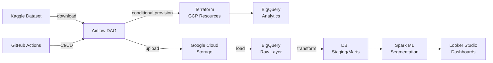

# Grocery Sales Insights

A production-ready end-to-end data analytics platform for the [Kaggle Grocery Sales Dataset](https://www.kaggle.com/datasets/drexibiza/grocery-sales-dataset).

This project demonstrates a modern data stack with orchestration, transformation, ML pipelines, and automated dashboards using Airflow, DBT, Spark, Terraform, and Looker Studio.

## 🏗️ Architecture Overview



## 📋 Components

- **Airflow** — Orchestration engine handling ETL workflows with conditional infrastructure provisioning
- **DBT** — Data transformation with staging, intermediate, and mart layers
- **Spark** — Customer segmentation and product recommendations ML pipeline
- **Terraform** — Infrastructure-as-code for GCP (BigQuery, GCS, service accounts, secrets)
- **Secret Manager** — Secure credential storage for Kaggle tokens, Looker Studio IDs, and DB passwords
- **Google Cloud Storage** — Raw data staging bucket
- **BigQuery** — Analytical data warehouse (raw, analytics, and mart datasets)
- **Looker Studio** — BI dashboards with auto-refresh via Airflow
- **GitHub Actions** — CI/CD workflows (lint, test, deploy on push)
- **Docker & Docker Compose** — Local development environment

## 🚀 Quick Start (Local Development)

### Prerequisites
- Docker & Docker Compose v2.24.0+
- Python 3.11+
- Git
- GCP account with service account key (for deployment)
- Kaggle API token

### 1. Setup Local Environment

```bash
git clone https://github.com/patelvipulkumar/grocery-sales-insights.git
cd grocery-sales-insights

# Create .env file for local development
cat > .env << EOF
GCP_PROJECT=your-project-id
RAW_BUCKET=your-project-id-grocery-raw
LOOKER_STUDIO_REPORT_ID=your-report-id
EOF
```

### 2. Start Services with Docker Compose

```bash
docker-compose up -d

# Check logs
docker-compose logs -f airflow-webserver

# Access Airflow UI
# URL: http://localhost:8080
# Username: admin
# Password: admin
```

### 3. Trigger the DAG

```bash
docker-compose exec airflow-webserver airflow dags unpause grocery_sales_end_to_end
docker-compose exec airflow-webserver airflow dags trigger grocery_sales_end_to_end
```

## 🔧 Deployment to GCP

### 1. Set Up GCP Project

```bash
export GCP_PROJECT="your-project-id"
export RAW_BUCKET="${GCP_PROJECT}-grocery-raw"

gcloud auth login
gcloud config set project $GCP_PROJECT
```

### 2. Configure Terraform

Create `terraform/terraform.tfvars`:

```hcl
project_id = "your-project-id"
region = "us-central1"
kaggle_api_token = "your-kaggle-api-key"
looker_studio_report_id = "your-looker-report-id"
airflow_db_password = "strong-password"
```

### 3. Initialize & Apply Terraform

```bash
cd terraform
terraform init
terraform plan
terraform apply

# Save outputs for deployment
terraform output -json > outputs.json
cd ..
```

### 4. Provision GCP VM

```bash
gcloud compute instances create grocery-analytics-vm \
  --zone=us-central1-a \
  --machine-type=e2-standard-4 \
  --image=ubuntu-2204-jammy-v20240319 \
  --metadata-from-file startup-script=setup.sh \
  --scopes=https://www.googleapis.com/auth/cloud-platform
```

### 5. Deploy Services

```bash
# SSH into VM
gcloud compute ssh grocery-analytics-vm --zone=us-central1-a

# Clone and deploy
git clone https://github.com/patelvipulkumar/grocery-sales-insights.git
cd grocery-sales-insights
docker-compose up -d
```

## 📊 Airflow DAG Workflow

The `grocery_sales_end_to_end` DAG executes sequentially:

1. **provision_infrastructure** — Terraform checks/creates GCP resources (conditional)
2. **download_kaggle** — Downloads dataset from Kaggle using API token
3. **upload_to_gcs** — Uploads CSV files to Google Cloud Storage
4. **load_to_bigquery** — Loads raw data into BigQuery `grocery_raw` dataset
5. **run_dbt** — Executes DBT pipeline:
   - `dbt deps` — Install dependencies
   - `dbt seed` — Load reference data (categories, cities, countries)
   - `dbt run` — Execute staging + mart models
   - `dbt test` — Run data quality tests
6. **run_spark** — Customer segmentation and product recommendations
7. **refresh_looker_studio** — Refresh Looker Studio dashboard cache

## 📁 Project Structure

```
.
├── .github/workflows/           # GitHub Actions CI/CD
│   ├── ci.yml                  # Lint, compile, test on push/PR
│   └── cd.yml                  # Build, deploy to GCP
├── airflow/
│   ├── dags/
│   │   └── grocery_pipeline.py # Main Airflow DAG
│   ├── Dockerfile              # Airflow custom image
│   └── requirements.txt         # Python dependencies
├── dbt/
│   ├── models/
│   │   ├── staging/            # Raw data transformations
│   │   ├── marts/              # Business-ready tables
│   │   └── sources.yml         # Source definitions
│   ├── data/                   # Seed files (categories, cities, countries)
│   ├── profiles.yml            # BigQuery connection config
│   └── dbt_project.yml
├── spark/
│   └── segmentation_reco.py    # ML pipeline for segmentation
├── terraform/
│   ├── main.tf                 # GCP resource definitions
│   ├── variables.tf            # Input variables
│   ├── outputs.tf              # Output values
│   └── versions.tf             # Terraform version lock
├── docker-compose.yml          # Local orchestration
├── README.md
└── ARCHITECTURE.md             # Detailed component documentation
```

## 🔐 Secrets Management

All sensitive credentials are stored in GCP Secret Manager:

| Secret | Usage |
|--------|-------|
| `kaggle-api-token` | Download from Kaggle |
| `looker-studio-report-id` | Refresh dashboard cache |
| `airflow-db-password` | Airflow metadata database |

Airflow DAG fetches secrets at runtime using `CloudSecretManagerHook`.

## ⚙️ Environment Variables

| Variable | Description |
|----------|-------------|
| `GCP_PROJECT` | GCP project ID |
| `RAW_BUCKET` | GCS bucket for raw data |
| `LOOKER_STUDIO_REPORT_ID` | Looker Studio dashboard ID |

## 🧪 Testing & Quality

### Run DBT Tests Locally

```bash
cd dbt
dbt test --profiles-dir .
```

### Run Lint Checks

```bash
flake8 airflow/dags/
```

### GitHub Actions CI/CD

- **On Push/PR:** Run lint, DBT compile, tests, Terraform fmt
- **On Merge to Main:** Build Docker image, push to GCR, trigger Terraform apply

## 📊 Creating Looker Studio Dashboard

1. Go to [Looker Studio](https://datastudio.google.com)
2. Create new report
3. Add data source: BigQuery → `grocery_analytics.mart_sales_summary` (or spark output tables)
4. Build charts and tiles
5. Share report ID with team (used in Terraform variables)
6. Airflow automatically refreshes the dashboard after each pipeline run

## 🐛 Troubleshooting

### DBT Compilation Fails
```bash
cd dbt
dbt deps --profiles-dir .
dbt compile --profiles-dir .
```

### Airflow DAG Not Appearing
```bash
docker-compose exec airflow-webserver airflow db reset
docker-compose exec airflow-webserver airflow dags list
```

### GCP Authentication Issues
```bash
gcloud auth application-default login
# or
gcloud iam service-accounts keys create gcp-key.json \
  --iam-account=airflow-sa@${GCP_PROJECT}.iam.gserviceaccount.com
```

### Docker Compose Permission Denied
```bash
sudo usermod -aG docker $USER
newgrp docker
docker-compose up
```

## 📚 Documentation

- [ARCHITECTURE.md](ARCHITECTURE.md) — Detailed component descriptions
- [DBT Docs](https://docs.getdbt.com/) — Data transformation best practices
- [Airflow Docs](https://airflow.apache.org/) — Workflow orchestration guide
- [Terraform Docs](https://www.terraform.io/docs/providers/google) — GCP resource management

## 🤝 Contributing

1. Create a feature branch: `git checkout -b feature/your-feature`
2. Make changes and test locally
3. Commit: `git commit -am 'Add feature'`
4. Push: `git push origin feature/your-feature`
5. Open PR and ensure CI passes
6. Merge to main (auto-deploys via GitHub Actions)

## 📄 License

MIT

    B --> H[Secret Manager (kaggle-api-token, GCP creds)]
    B --> I[Terraform infra provisioning]

    subgraph Local Dev
      J[docker-compose: airflow, postgres, redis, spark]
      J -- runs --> B
      J -- contains --> E
      J -- contains --> F
    end

    subgraph GCP
      C
      D
      E
      F
      G
      H
      I
    end
```

